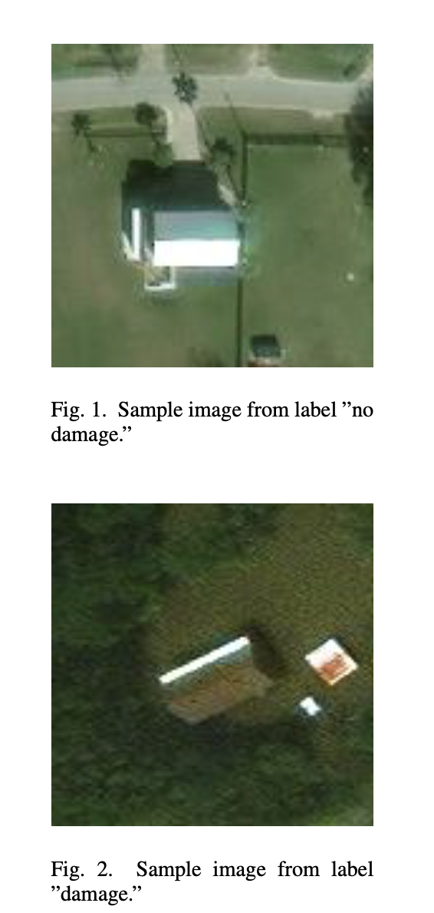
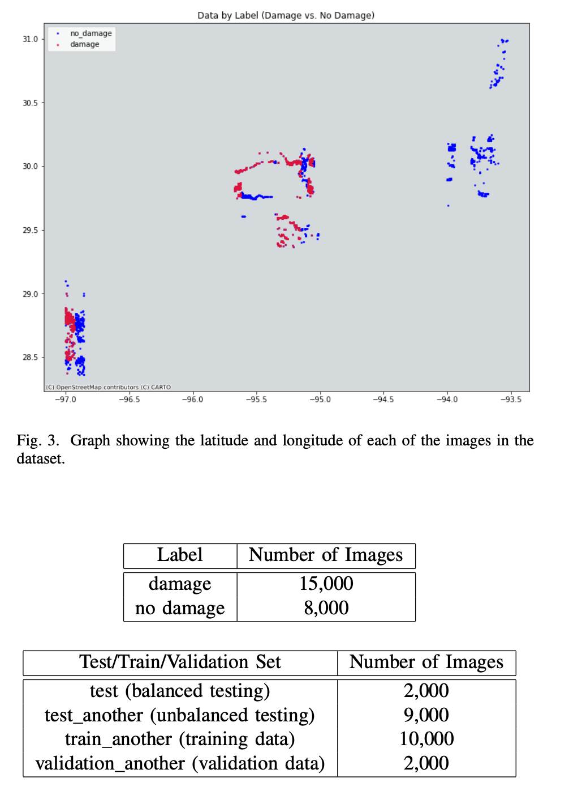
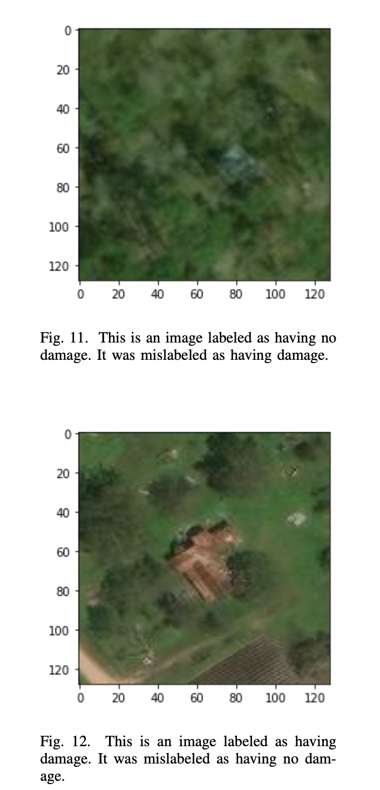
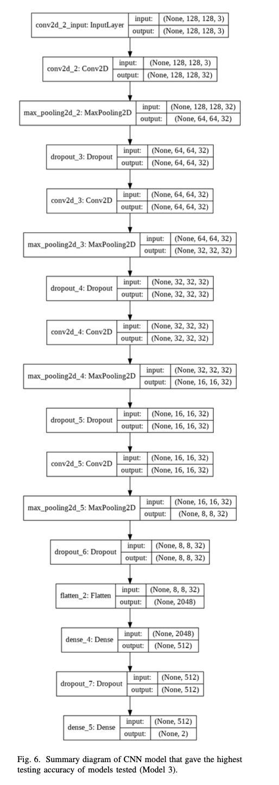
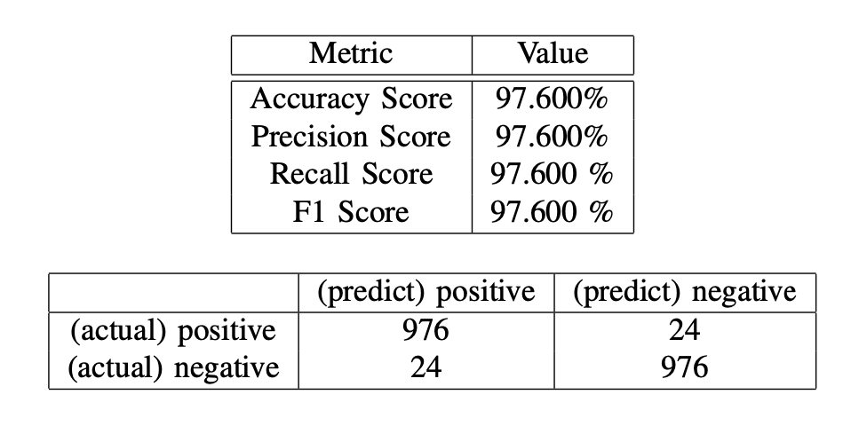

# Building Damage Response Image Detection

## Objective

The purpose of this project is to use deep learning image classification to assess whether buildings have damage. These techniques could be used to aid in disaster response.

### Methods Used
* Classification
* Image detection
* Deep Learning
* Convolutional Neural Networks

### Technologies
* Python

## Project Background

Assessment of damaged buildings is a critical step in emergency response after hurricanes and other severe weather events. Such assessments help guide where response and further evaluation is most needed, as well as provide an overall picture of infrastructure damage to a region. However, determining which buildings have sustained flood damage during hurricane events can be a difficult and time intensive process. When done via surveying of individual buildings, it may also require particular expertise in structural engineering or damage assessment.

Remote Sensing (RS) and Geographic Information Technologies (GIS) technologies provide opportunities for automat- ing parts of this detection process. In particular, machine learning techniques have shown great success for satellite image classification tasks and could potentially be applied in this context.

This project investigates the use of deep learning techniques for post-hurricane damage assessment, focusing on Houston, TX after Hurricane Harvey (2017) as a case study. 

### Data Summary

**Example images in dataset:**

**Overview of Dataset**

## Project Findings and Model Evaluation

Using pre- labeled satellite images from this region, I develop several models for evaluating whether a satellite image contains a building that has flood damage. In particular, I focus on the application of Convolutional Neural Networks (CNNs), which are typically very effective at image classification and segmentatioin tasks. These models proved to have high accuracy (97%) at this task, as well.

**Example Missclassifications**

**Final CNN Model Summary**

**Final Model Evaluation**

## Additional Details

For more details see:
* [Project code](image_detection_notebook.ipynb)
* [Project paper](report.pdf)
* [Presentation slides](presentation.pdf)